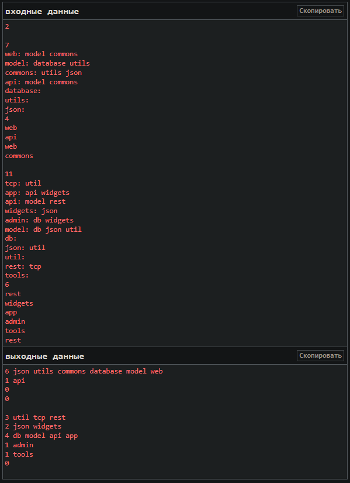

# Механизм решения зависимостей Make

Напишите программу, которая по заданному журналу звонков восстанавливает адресную книгу.

Каждая запись журнала имеет вид: «имя_абонента телефон_абонента». Записи даны в хронологическом порядке от наиболее ранней к самой последней.

Адресная книга позволяет хранить по имени абонента один или несколько его телефонов (но не более пяти). Если в журнале для абонента содержится более пяти телефонов, то сохранятся пять наиболее «свежих» (то есть таких, что последний звонок по ним был как можно позже). Иными словами, из телефонной книги выбрасываются те номера, по которым дольше всего не было звонка.

Выведите телефонную книгу как набор строк в формате «имя_абонента: n t_1 t_2 ... t_n», где n от 1 до 5 (включительно), а t_1 t_2 ... t_n — номера абонента в порядке от наиболее недавно использованного. Строки в телефонной книге сортируйте в порядке лексикографического возрастания имён абонентов (то есть просто алфавитно).

Неполные решения этой задачи (например, недостаточно эффективные) могут быть оценены частичным баллом.

## Входные данные
В первой строке записано целое число t (1≤t≤104) — количество наборов входных данных.

Далее записаны t наборов входных данных.

Описание каждого набора начинается строкой, содержащей целое число n (1≤n≤105) — количество записей в журнале.

Далее идут n строк, каждая содержит одну запись журнала. Записи заданы в хронологическом порядке от наиболее старой к наиболее новой. Каждая запись имеет вид: «имя_абонента телефон_абонента», где имя_абонента — это строка длины от 1 до 8, которая состоит из строчных латинских букв, а телефон_абонента — это строка, которая содержит ровно 7 цифр (может начинаться с нуля). Гарантируется, что нет двух абонентов с одинаковым номером (то есть каждый номер соответствует одному абоненту).

Гарантируется, что сумма значений n по всем наборам входных данных в тесте не превосходит 105.

## Выходные данные
Для каждого набора входных данных выведите соответствующую телефонную книгу в виде последовательности строк «имя_абонента: n t_1 t_2 ... t_n», где n от 1 до 5 (включительно), а t_1 t_2 ... t_n — номера абонента в порядке от наиболее недавно использованного. Строки в телефонной книге сортируйте в порядке лексикографического возрастания имён абонентов (то есть просто алфавитно).

После каждой телефонной книги выводите дополнительный перевод строки.

## Пример
